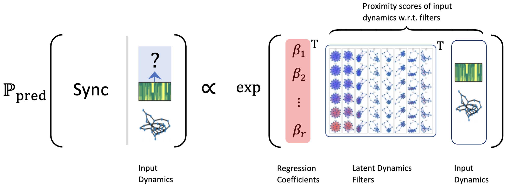

# A Generalized Latent Linear Model for Synchronization Prediction
This is the code repository for the paper "A Generalized Latent Linear Model for Synchronization Prediction" by Agam Goyal, Zhaoxing Wu, Binhao Chen, Zihong Xu, Richard P. Yim and Hanbaek Lyu.

## Respository Structure:

## Repository API:

